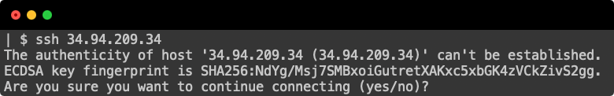

GCP SSH Certificate Authority
=============================

Mitigate the MITM threat on the first SSH into a GCP VM by signing the VM's SSH Key with a central Certificate Authority. Solves this problem:



### GCP CA Usage
1. **Create** your CA key in a secure place.
    ```shell
    # Generate an ed25519 signing public/private keypair
    ssh-keygen -t ed25519 -f ca_key
    ```
2. **Clients trust** this CA by adding the CA's pubkey to their known hosts file in the following format. This trusts the CA to sign _all_ hosts.
    ```shell
    echo "@cert-authority * $(cat ca_key.pub)" >> ~/.ssh/known_hosts
    ```
3. **Configure and start** the CA Signer. `config.yaml` should contain a list of GCP Project and Folder IDs, within which you'd like to sign the SSH keys of GCE VMs.
    ```shell
    go build 
    ./gcp-ssh-ca --ca-keyfile ./ca_key --config-file ./config.yaml
    ```
4. **Configure GCE VMs** within these Project and Folder IDs by (re)launching with two special changes. First, machines should be launched with [Guest Attributes](https://cloud.google.com/compute/docs/storing-retrieving-metadata#guest_attributes) enabled. Second, instances should be launched with the custom startup script we provide which publishes the instance's public SSH key and waits for the `gcp-ssh-ca` to sign the key.
    ```terraform
    metadata = {
        startup-script = file("${path.module}/startup.sh")
        enable-guest-attributes = "TRUE"
    }
    # Metadata will be updated by our CA signer.
    lifecycle { ignore_changes = [metadata] }
    ```
5. **SSH!** Once the instance has launched, `gcp-ssh-ca` will sign the instance's key and your startup script will replace the instance's pubkey with the signed pubkey. You can then SSH directly into your machines without seeing an authenticity issue.

### What's _Really_ Going on Here? 

GCE recently released [Guest Attributes](https://cloud.google.com/compute/docs/storing-retrieving-metadata#guest_attributes) which create a new write-only key/value store that any process on an instance can write directly to like so:
```shell 
curl -X PUT \
    --data "$(cat /etc/ssh/ssh_host_ed25519_key.pub)" \
    -H "Metadata-Flavor: Google" \
    http://metadata.google.internal/computeMetadata/v1/instance/guest-attributeshostkeys/ed25519 
```
Guest attributes allows us to safely expose the instance's public key through the GCP control plane without requiring any special permissions. We can then read (only) guest attributes from any VM like so:

```shell
gcloud beta compute instances get-guest-attributes \
    instance \
    --zone us-west1-a \
    --project testing
```

A central CA can then safely identify public keys, and sign them with a centrally trusted key and _specific IP addresses_ that this key is authorized .  This can be done with ssh-keygen like so:

```shell
PUBLIC_IP="1.2.3.4"
PRIVATE_IP="2.3.4.5"
CERT_ID="host-id"
KEY_TO_SIGN="some_instances_key.pub"
KEY_TO_SIGN="ca_key"
ssh-keygen \
    -s server_ca \
    -I ${CERT_ID} \
    -h -n ${PUBLIC_IP},${PRIVATE_IP} \
    -V +4w \
    ${KEY_TO_SIGN}
```

The instance now needs to serve up this _signed_ pubkey for clients to trust, but first it needs to retrieve the signed pubkey from the CA.  This can again be done without any special permissions using the instances key/value metadata like so:

```shell
gcloud compute instances add-metadata ........
```

On boot, the instance waits for this signed pubkey to appear, and restarts sshd so we serve the new key:

```shell
echo "Try to pull signed SSH key down from the metadata service for 60s"
for i in {1..60}; do
  # Check the Metadata Service for a signed key
  signed_key=$(curl --silent -H "Metadata-Flavor: Google" \
    "http://metadata.google.internal/computeMetadata/v1/instance/attributes/hostkeys-signed-ssh-ed25519")
  if [[ $signed_key == "ssh-ed25519-cert"* ]]; then
    echo "Signed key found.  Saving to disk"
    # Save to disk
    echo $signed_key > /etc/ssh/ssh_host_ed25519_key-cert.pub
    # Configure sshd_config to use certs
    echo 'HostCertificate /etc/ssh/ssh_host_ed25519_key-cert.pub' >> /etc/ssh/sshd_config
    # Reload sshd
    systemctl reload sshd
    break
  fi
  sleep 1
done
```

When any clients attempts to SSH into the machine, the machine will now serve up a pubkey signed by our CA which protects us against a man-in-the-middle attempting to intercept our SSH traffic:

```shell
ssh 1.2.3.4
$ ...
```

### Security Considerations

* A compromised machine now has the ability to extract signed certs, but _only_ certs signed for the public and private instances of this machine.
* Your CA now becomes a central point of trust.  If this key is ever stolen, any SSH pubkeys can be signed, but users need to be tricked to SSH'ing into those machines.
* By default, these certs are only valid for 365 days.  If your VMs _must_ live for longer than this, you'll need something to rotate the signed pubkeys.
* Bad guys with access to edit instance metadgata could inject an arbitrary payloadinto an instances metadata, but altering a public key would not match the instance's _private key_ which would break the initial SSH handshake.